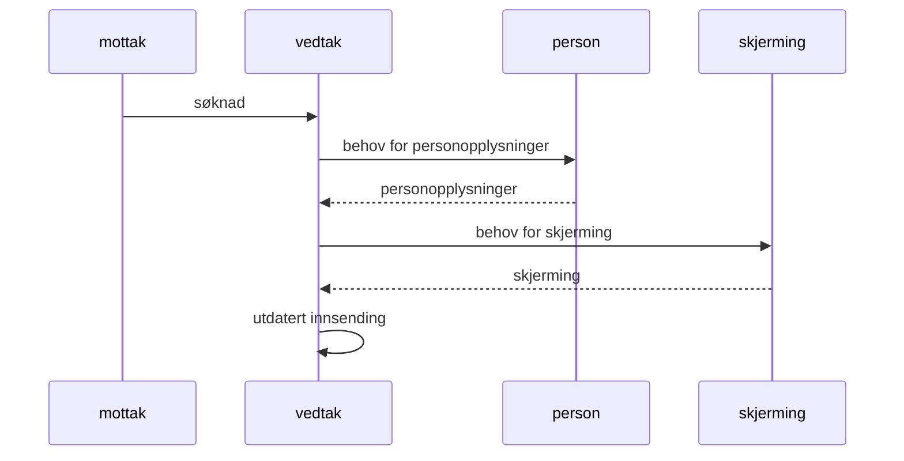

# tiltakspenger

Startpunkt (metarepo) for tiltakspenger

## Komme i gang

### Oppsett av meta-repo

[meta](https://github.com/mateodelnorte/meta) brukes til å sette opp
repositories for alle repoene.

Enn så lenge må du sørge for å ha `npm` installert (`brew install node`).

```
npm install meta -g --no-save
```

Merk! meta foran vanlig clone-kommando:

```
meta git clone git@github.com:navikt/tiltakspenger.git
```

Nå kan git brukes som normalt for hvert repo.

For å legge til et nytt repo kan man skrive

```
meta project import tiltakspenger-whatnot git@github.com:navikt/tiltakspenger-whatnot
```

Se [meta](https://github.com/mateodelnorte/meta) for flere kommandoer.

Dersom du nå åpner `build.gradle` med `Open` (som Project) i IntelliJ så får du alle komponentene inn i ett
IntelliJ-oppsett.

Repoene som er inkludert i dette meta-repoet er

- [tiltakspenger-iac] (https://github.com/navikt/tiltakspenger-iac)
- [tiltakspenger-libs] (https://github.com/navikt/tiltakspenger-libs)
- [tiltakspenger-arena] (https://github.com/navikt/tiltakspenger-arena)
- [tiltakspenger-vedtak] (https://github.com/navikt/tiltakspenger-vedtak)
- [tiltakspenger-tiltak] (https://github.com/navikt/tiltakspenger-tiltak)
- [tiltakspenger-saksbehandler] (https://github.com/navikt/tiltakspenger-saksbehandler)
- [tiltakspenger-soknad-api] (https://github.com/navikt/tiltakspenger-soknad-api)
- [tiltakspenger-soknad-mock-api] (https://github.com/navikt/tiltakspenger-soknad-mock-api)
- [tiltakspenger-pdfgen] (https://github.com/navikt/tiltakspenger-pdfgen)
- [tiltakspenger-soknad] (https://github.com/navikt/tiltakspenger-soknad)
- [tiltakspenger-datadeling] (https://github.com/navikt/tiltakspenger-datadeling)

Lenker til PR-sidene
- [tiltakspenger-arena] (https://github.com/navikt/tiltakspenger-arena/pulls)
- [tiltakspenger-datadeling] (https://github.com/navikt/datadeling/pulls)
- [tiltakspenger-iac] (https://github.com/navikt/tiltakspenger-iac/pulls)
- [tiltakspenger-libs] (https://github.com/navikt/tiltakspenger-libs/pulls)
- [tiltakspenger-pdfgen] (https://github.com/navikt/tiltakspenger-pdfgen/pulls)
- [tiltakspenger-saksbehandler] (https://github.com/navikt/tiltakspenger-saksbehandler/pulls)
- [tiltakspenger-soknad] (https://github.com/navikt/tiltakspenger-soknad/pulls)
- [tiltakspenger-soknad-api] (https://github.com/navikt/tiltakspenger-soknad-api/pulls)
- [tiltakspenger-soknad-mock-api] (https://github.com/navikt/tiltakspenger-soknad-mock-api/pulls)
- [tiltakspenger-tiltak] (https://github.com/navikt/tiltakspenger-tiltak/pulls)
- [tiltakspenger-vedtak] (https://github.com/navikt/tiltakspenger-vedtak/pulls)



### Lokal kjøring av verdikjeden

Meta-repoet kommer med et docker-compose oppsett som kan benyttes for å kjøre opp
hele verdikjeden lokalt i Docker-containere, med noen unntak (`tiltakspenger-saksbehandler`,
`tiltakspenger-soknad` og `tiltakspenger-soknad-api`). Merk at `tiltakspenger-saksbehandler` kan kjøres opp
på siden av øvrige apper for å kunne teste frontend lokalt.

#### Bruk av docker-compose oppsett for saksbehandling

For enkel bruk av docker-compose-oppsett er det skrevet noen bash-script som ligger på
rot av dette repositoryet.

| script          | beskrivelse                                                                                                                                                |
|-----------------|------------------------------------------------------------------------------------------------------------------------------------------------------------|
| ./up.sh         | Script for å bygge og starte alle apper i docker-compose (se i [up.sh](https://github.com/navikt/tiltakspenger/blob/main/up.sh) for tilgjengelige options) |
| ./down.sh       | Script for å stoppe alle apper i docker-compose (se i [down.sh](https://github.com/navikt/tiltakspenger/blob/main/down.sh) for tilgjengelige options)      |
| ./dkill.sh      | Script for å kjøre docker compose down, stopper og fjerner alle containere som eventuelt fortsatt kjører, og fjerner det tilhørende nettverket             |
| ./slettAlt.sh   | Kjører "docker compose down --rmi all --volumes", i.e. sletter alt.                                                                                        |
| ./slettBaser.sh | Kjører "docker compose down --volumes", i.e. sletter basene.                                                                                               |

#### Bruk av docker-compose oppsett for søknad

For kjøring av utviklingsmiljø for å jobbe med søknaden er det lagd et eget bash-script på
rot av dette repositoryet. Det kan kjøres opp med eller uten søknads-api'et, hvis man eksempelvis
skulle ønske å kjøre opp api'et fra IntelliJ.

| script           | beskrivelse                                                                                                                                                                     |
|------------------|---------------------------------------------------------------------------------------------------------------------------------------------------------------------------------|
| ./up-soknad.sh   | Script for å bygge og starte alle apper i docker-compose-soknad (se i [up-soknad.sh](https://github.com/navikt/tiltakspenger/blob/main/up-soknad.sh) for tilgjengelige options) |
| ./down-soknad.sh | Script for å stoppe alle apper i docker-compose (se i [down-søknad.sh](https://github.com/navikt/tiltakspenger/blob/main/down-soknad.sh) for tilgjengelige options)             |
