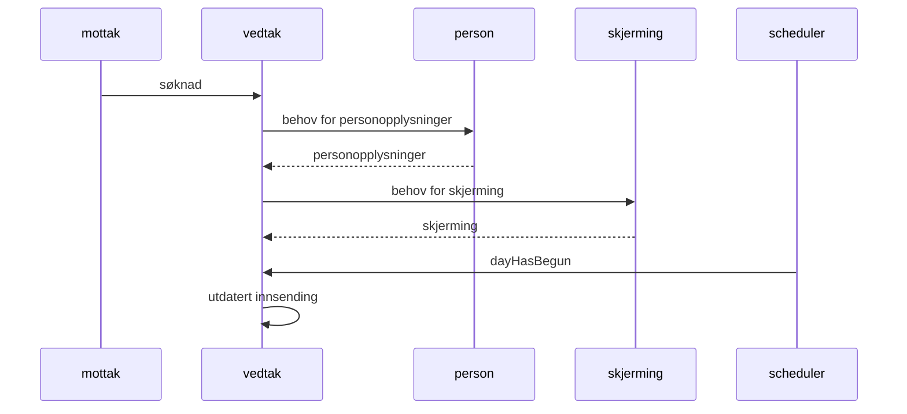

# tiltakspenger

Startpunkt (metarepo) for tiltakspenger

## Komme i gang

[meta](https://github.com/mateodelnorte/meta) brukes til å sette opp
repositories for alle repoene.

Enn så lenge må du sørge for å ha `npm` installert (`brew install node`).

```
npm install meta -g --no-save
```

Merk! meta foran vanlig clone-kommando:

```
meta git clone git@github.com:navikt/tiltakspenger.git
```

Nå kan git brukes som normalt for hvert repo.

For å legge til et nytt repo kan man skrive

```
meta project import tiltakspenger-whatnot git@github.com:navikt/tiltakspenger-whatnot
```

Se [meta](https://github.com/mateodelnorte/meta) for flere kommandoer.

Dersom du nå åpner `build.gradle` med `Open` (som Project) i IntelliJ så får du alle komponentene inn i ett
IntelliJ-oppsett.

Repoene som er inkludert i dette meta-repoet er

- [tiltakspenger-iac] (https://github.com/navikt/tiltakspenger-iac)
- [tiltakspenger-libs] (https://github.com/navikt/tiltakspenger-libs)
- [tiltakspenger-mottak] (https://github.com/navikt/tiltakspenger-mottak)
- [tiltakspenger-arena] (https://github.com/navikt/tiltakspenger-arena)
- [tiltakspenger-person] (https://github.com/navikt/tiltakspenger-person)
- [tiltakspenger-fp] (https://github.com/navikt/tiltakspenger-fp)
- [tiltakspenger-ufore] (https://github.com/navikt/tiltakspenger-ufore)
- [tiltakspenger-institusjon] (https://github.com/navikt/tiltakspenger-institusjon)
- [tiltakspenger-skjerming] (https://github.com/navikt/tiltakspenger-skjerming)
- [tiltakspenger-vedtak] (https://github.com/navikt/tiltakspenger-vedtak)
- [tiltakspenger-tiltak] (https://github.com/navikt/tiltakspenger-tiltak)
- [tiltakspenger-vedtak-rivers] (https://github.com/navikt/tiltakspenger-vedtak-rivers)
- [tiltakspenger-testmeldinger] (https://github.com/navikt/tiltakspenger-testmeldinger)
- [tiltakspenger-saksbehandler] (https://github.com/navikt/tiltakspenger-saksbehandler)
- [tiltakspenger-scheduler] (https://github.com/navikt/tiltakspenger-scheduler)
- [tiltakspenger-template] (https://github.com/navikt/tiltakspenger-template)
- [tiltakspenger-admin] (https://github.com/navikt/tiltakspenger-admin)
- [tiltakspenger-overgangsstonad] (https://github.com/navikt/tiltakspenger-overgangsstonad)
- [tiltakspenger-soknad-api] (https://github.com/navikt/tiltakspenger-soknad-api)
- [tiltakspenger-pdfgen] (https://github.com/navikt/tiltakspenger-pdfgen)
- [tiltakspengesoknad] (https://github.com/navikt/tiltakspenger-soknad)

Lenker til PR-sidene

- [tiltakspenger-iac] (https://github.com/navikt/tiltakspenger-iac/pulls)
- [tiltakspenger-libs] (https://github.com/navikt/tiltakspenger-libs/pulls)
- [tiltakspenger-mottak] (https://github.com/navikt/tiltakspenger-mottak/pulls)
- [tiltakspenger-arena] (https://github.com/navikt/tiltakspenger-arena/pulls)
- [tiltakspenger-person] (https://github.com/navikt/tiltakspenger-person/pulls)
- [tiltakspenger-fp] (https://github.com/navikt/tiltakspenger-fp/pulls)
- [tiltakspenger-ufore] (https://github.com/navikt/tiltakspenger-ufore/pulls)
- [tiltakspenger-institusjon] (https://github.com/navikt/tiltakspenger-institusjon/pulls)
- [tiltakspenger-skjerming] (https://github.com/navikt/tiltakspenger-skjerming/pulls)
- [tiltakspenger-vedtak] (https://github.com/navikt/tiltakspenger-vedtak/pulls)
- [tiltakspenger-vedtak-rivers] (https://github.com/navikt/tiltakspenger-vedtak-rivers/pulls)
- [tiltakspenger-testmeldinger] (https://github.com/navikt/tiltakspenger-testmeldinger/pulls)
- [tiltakspenger-saksbehandler] (https://github.com/navikt/tiltakspenger-saksbehandler/pulls)
- [tiltakspenger-scheduler] (https://github.com/navikt/tiltakspenger-scheduler/pulls)
- [tiltakspenger-template] (https://github.com/navikt/tiltakspenger-template/pulls)
- [tiltakspenger-admin] (https://github.com/navikt/tiltakspenger-admin/pulls)
- [tiltakspenger-overgangsstonad] (https://github.com/navikt/tiltakspenger-overgangsstonad/pulls)
- [tiltakspenger-soknad-api] (https://github.com/navikt/tiltakspenger-soknad-api/pulls)
- [tiltakspenger-pdfgen] (https://github.com/navikt/tiltakspenger-pdfgen/pulls)
- [tiltakspenger-soknad] (https://github.com/navikt/tiltakspenger-soknad/pulls)


